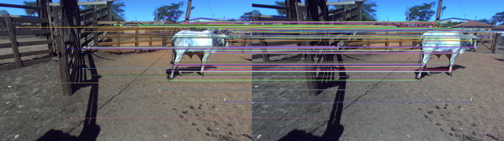
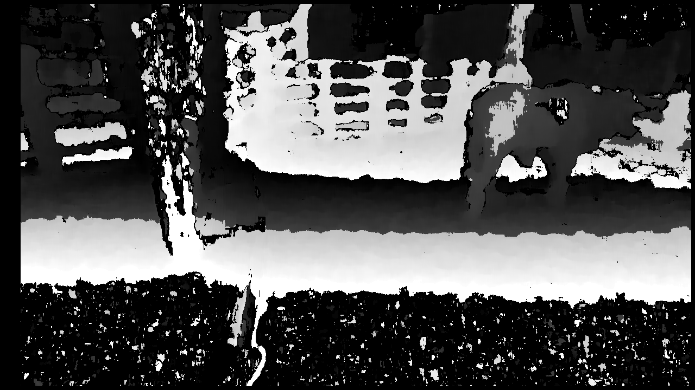

<h1 align="center">
  
</h1>

<!-- <div align="center">
  Stereo 3D Reconstruction and Epipolar Geometry Processing
  <br />
  <br />
  <a href="https://github.com/VitordsAmorim/deep-map-stereo-camera/issues/new?assignees=&labels=bug&template=01_BUG_REPORT.md&title=bug%3A+">Report a Bug</a>
·
<a href="https://github.com/VitordsAmorim/deep-map-stereo-camera/issues/new?assignees=&labels=enhancement&template=02_FEATURE_REQUEST.md&title=feat%3A+">Request a Feature</a>
·
<a href="https://github.com/VitordsAmorim/deep-map-stereo-camera/discussions">Ask a Question</a>
</div> -->

<div align="center">
<br />

[](https://github.com/VitordsAmorim/Depth-Map-Stereo-Camera/blob/main/LICENSE)

<!-- [](LICENSE)

[](https://github.com/VitordsAmorim)
[](https://github.com/dec0dOS) -->

</div>

<details close>
<summary>Table of Contents</summary>

- [About](#about)
- [Additional Infor](#additional-infor)
- [Getting Started](#getting-started)
  - [Prerequisites](#prerequisites)
  - [Usage](#usage)
- [License](#license)
- [Contributors](#contributors)
- [Future Improvements](#future-improvements)
- [Acknowledgements](#acknowledgements)

</details>

---

## About

<table>
<tr>
<td>

This repository contains a set of Python scripts that implement stereoscopic image processing techniques, including:

- Feature detection and matching between images captured by a stereo camera system;
- Calculation of the extrinsic parameters between the cameras, which is essential for point cloud reconstruction (not implemented in this project);
- Computation of the disparity map and depth map.


<details close>
<summary>Additional info</summary>
<br>

- **Main Libraries:**
  - **NumPy:** For matrix operations and array manipulation.
  - **OpenCV:** For image processing and computer vision (feature detection, matching, disparity calculation, etc.).
  - **Matplotlib:** For visualizing images and plots.

- **Reference Files:** 
  - The main script reads the image pair paths from the `reference.txt` file. Each line in this file should contain the paths for the left and right images, separated by a space.

</details>

</td>
</tr>
</table>


## Getting Started

### Prerequisites

Python 3.11 (this version was used during development, but other versions may also work).


Install the required dependencies with the following commands:

```sh
pip install numpy
```

```sh
pip install opencv-python
```

```sh
pip install matplotlib
```

### Usage


1. **Clone the Repository:**

   ```bash
   git clone https://github.com/VitordsAmorim/Depth-Map-Stereo-Camera
   cd Depth-Map-Stereo-Camera
   ```

2. **Configure o arquivo reference.txt:**

   - Create a reference.txt file in the root of the repository.

   - On each line, insert the paths for the left and right images, separated by a space. For example:

    ```bash
    left_image1.jpg right_image1.jpg  
    ```

3. **Run the Script:**

   ```python
    python Deep_map.py
   ```
   
### Output
- The script processes the first image pair found in `reference.txt`:
  - **Feature Matches:** Visual representation of the matched keypoints.

    

  - **Disparity Map:** The computed disparity map.

    

  ### Extrinsic Parameters

    ### Essential Matrix
    ```python
    [[-0.00088287 -0.52199232 -0.001382  ]
    [ 0.51832308 -0.02138079 -0.47991273]
    [ 0.02449366  0.47651033 -0.02066664]]
    ```

    **Matriz de Rotação:**

    ```python
    [[ 0.99997769 -0.00167419 -0.00646662]
    [ 0.00139458  0.99907393 -0.04300397]
    [ 0.00653262  0.04299399  0.99905397]]
    ```

    **Translation Matrix:**

    ```python
    [[-0.6745685 ]
    [ 0.03369928]
    [-0.73744268]]
    ```


## Licença

Este projeto está licenciado sob a [LICENSE](LICENSE) **MIT**.


## Contribuição

|<a href="https://github.com/VitordsAmorim"></a>
  |:-:|
  |Vitor Amorim |
